# ShopAI Rwanda — Architecture Diagram

```mermaid
%%{init: {'theme': 'base', 'themeVariables': { 'primaryColor': '#0f3460', 'primaryTextColor': '#fff', 'primaryBorderColor': '#0a1628', 'lineColor': '#4fc3f7', 'secondaryColor': '#1a1a2e', 'tertiaryColor': '#16213e', 'clusterBkg': '#0d1b2a', 'clusterBorder': '#1b3a5c', 'nodeBorder': '#4fc3f7', 'fontSize': '14px'}}}%%

flowchart TB
    subgraph Client["🌐 FRONTEND (Browser)"]
        User["👤 User / Customer"] --> ChatWidget["💬 Chat Widget<br/>chatbot.js"]
        User --> WebPages["📄 Web Pages<br/>index, products, cart,<br/>checkout, orders, profile"]
        User --> Admin["🛠️ Admin Panel<br/>admin/index.php"]
    end

    subgraph Apache["⚡ APACHE WEB SERVER (PHP 8.x)"]
        direction TB
        
        subgraph API["📡 API Layer"]
            ChatbotAPI["🤖 Main Chatbot<br/>api/chatbot.php"]
            ChatbotSimple["🔸 Simple Chatbot<br/>api/chatbot_simple.php"]
            ChatbotEnhanced["🔸 Enhanced Chatbot<br/>api/chatbot_enhanced.php"]
            ChatbotStreaming["🔸 Streaming Chatbot<br/>api/chatbot_streaming.php"]
            ChatbotFeedback["👍 Feedback<br/>api/chatbot_feedback.php"]
            FileUpload["📤 File Upload<br/>api/upload.php"]
            ProductSearch["🔍 Product Search<br/>api/search.php"]
        end

        subgraph Auth["🔐 Authentication"]
            Login["login.php"]
            Register["register.php"]
            Forgot["forgot_password.php"]
            Security["includes/security.php<br/>CSRF, Rate Limit, XSS"]
        end

        subgraph Business["🏪 Business Logic"]
            Cart["🛒 cart.php"]
            Checkout["checkout.php"]
            Orders["📦 orders.php"]
            Profile["👤 profile.php"]
            Wishlist["❤️ wishlist.php"]
            Invoice["🧾 invoice.php"]
            ProductDetail["📋 product.php"]
        end

        subgraph AdminPanel["📊 Admin Panel"]
            Dashboard["📈 Dashboard"]
            ProductCRUD["📦 Products CRUD"]
            OrderMgmt["📋 Orders Mgmt"]
            UserMgmt["👥 Users"]
            ChatLogs["💬 Chat Logs"]
            MLAnalytics["🤖 ML Performance"]
            Analytics["📊 Analytics"]
            Tickets["🎫 Support Tickets"]
            CSVExport["📄 CSV Export"]
        end

        subgraph Includes["🧩 Shared Includes"]
            Header["includes/header.php"]
            Footer["includes/footer.php"]
            Mailer["📧 mailer.php"]
            GeminiGate["includes/chatbot_gemini_gate.php"]
            LangDetect["🌐 Language Detection"]
            Inventory["includes/inventory.php"]
            Metrics["📊 metrics_collector.php"]
            Artifacts["🤖 ml_artifacts.php"]
        end
    end

    subgraph ML["🐍 FLASK ML API (Python 3.x — Port 5000)"]
        direction TB
        FlaskApp["app.py"]
        
        subgraph Routes["Routes"]
            Health["GET /health"]
            Predict["POST /predict<br/>SVM Intent Classification"]
            PredictAll["POST /predict/all"]
            Chat["POST /chat<br/>Full Pipeline"]
            ModelsPerf["GET /models/performance"]
            Intents["GET /intents"]
            RebuildIndex["POST /rebuild-index"]
            SemanticSearch["POST /semantic-search<br/>FAISS Vector Search"]
        end

        subgraph MLModules["ML Modules"]
            EntityExtractor["🔍 entity_extractor.py<br/>40+ brands, 15 categories"]
            Recommender["📊 recommender.py<br/>SQL + Scoring Engine"]
            ResponseGen["💬 response_generator.py<br/>Gemini Formatting"]
            Semantic["🔎 semantic_search.py<br/>FAISS + sentence-transformers"]
            SpellChecker["✏️ spell_corrector.py<br/>SymSpell"]
            Memory["🧠 memory.py<br/>Session Context"]
            BertClassifier["🤖 bert_classifier.py"]
        end

        subgraph MLModels["ML Model Artifacts"]
            SVM["svm_linear.pkl<br/>⭐ PRIMARY ~95.7%"]
            LR["logistic_regression.pkl<br/>~89%"]
            RF["random_forest.pkl<br/>~89%"]
            BERT["bert_intent_classifier/<br/>~91%"]
            TFIDF["tfidf_vectorizer.pkl"]
            LabelEnc["label_encoder.pkl"]
            FAISS["product_embeddings.faiss"]
            ModelResults["model_results.json"]
        end
    end

    subgraph DB["🗄️ MYSQL DATABASE (ecommerce_chatbot)"]
        direction TB
        
        subgraph Ecommerce["E-commerce Tables"]
            Users["users<br/>customers + admins"]
            Products["products<br/>1,161 items"]
            Categories["categories<br/>15 categories"]
            OrdersT["orders"]
            OrderItems["order_items"]
            CartT["cart"]
            CartItems["cart_items"]
            Reviews["reviews"]
            WishlistT["wishlist"]
        end

        subgraph Chatbot["Chatbot Tables"]
            ChatLogsT["chatbot_logs<br/>40k+ interactions"]
            ChatFeedback["chatbot_feedback"]
            ChatContext["chatbot_context"]
            ChatMemory["chatbot_memory"]
            ChatIntents["chatbot_intents"]
        end

        subgraph Support["Support & Analytics"]
            SupportTickets["support_tickets"]
            ProductViews["product_views"]
            PredictionMetrics["prediction_metrics"]
            GeminiLog["gemini_api_log"]
            ChatUploads["chat_uploads"]
            ImageMatches["image_recognition_matches"]
        end
    end

    subgraph External["🔗 EXTERNAL SERVICES"]
        Gemini["🧠 Google Gemini API<br/>2.0 Flash / 1.5 Pro"]
        SMTP["📧 Brevo SMTP<br/>Email (welcome,<br/>orders, invoices)"]
        Twilio["📱 Twilio SMS<br/>(optional)"]
        GoogleCSE["🔍 Google CSE<br/>Product Images"]
        Unsplash["🖼️ Unsplash API<br/>Product Images"]
    end

    %% ── CONNECTIONS ──

    %% Frontend → Apache
    ChatWidget -- "POST /api/chatbot.php<br/>{message, session_id}" --> ChatbotAPI
    ChatWidget -- "POST /api/chatbot_simple.php" --> ChatbotSimple
    ChatWidget -- "POST /api/chatbot_enhanced.php" --> ChatbotEnhanced
    ChatWidget -- "POST /api/chatbot_streaming.php<br/>NDJSON stream" --> ChatbotStreaming
    ChatWidget -- "POST /api/chatbot_feedback.php" --> ChatbotFeedback
    ChatWidget -- "POST /api/upload.php" --> FileUpload
    ChatbotFeedback --> ChatLogsT
    FileUpload --> ChatUploads

    WebPages -- "AJAX /api/search.php?q=" --> ProductSearch
    WebPages --> Login
    WebPages --> Register
    WebPages --> Cart
    WebPages --> Checkout
    WebPages --> Orders

    Admin ===> Dashboard
    Admin ===> ProductCRUD
    Admin ===> OrderMgmt
    Dashboard -- "reads" --> Analytics
    CSVExport --> OrdersT

    %% Apache → DB
    Cart --> CartT
    Checkout --> OrdersT
    Register --> Users
    Auth --> Users
    OrdersT --> OrderItems
    Products --> Categories
    Login --> Users

    %% Includes
    ChatbotAPI --> Security
    ChatbotAPI --> Mailer
    ChatbotAPI --> GeminiGate
    ChatbotAPI --> LangDetect
    ChatbotAPI --> Metrics
    ChatbotAPI --> Artifacts
    ChatbotAPI --> Inventory
    ChatbotSimple --> LangDetect
    ChatbotEnhanced --> GeminiGate
    ChatbotEnhanced --> LangDetect

    %% Chatbot → DB
    ChatbotAPI -- "reads/writes" --> ChatLogsT
    ChatbotAPI -- "reads/writes" --> ChatContext
    ChatbotAPI -- "reads/writes" --> ChatMemory
    ChatbotAPI -- "intent patterns" --> ChatIntents
    ChatbotAPI -- "product queries" --> Products
    ChatbotAPI -- "order queries" --> OrdersT
    ChatbotAPI -- "user queries" --> Users
    ChatbotAPI -- "support tickets" --> SupportTickets
    ChatbotAPI -- "view tracking" --> ProductViews

    ChatbotSimple -- "product queries" --> Products
    ChatbotSimple -- "context" --> ChatContext
    ChatbotSimple -- "logs" --> ChatLogsT

    ChatbotEnhanced -- "image matches" --> ImageMatches

    %% Chatbot → ML API
    ChatbotAPI -- "POST /predict<br/>(SVM intent)" --> Predict
    ChatbotAPI -- "POST /chat<br/>(full pipeline)" --> Chat
    ChatbotAPI -- "POST /semantic-search<br/>(FAISS)" --> SemanticSearch
    ChatbotSimple -- "POST /predict" --> Predict

    %% ML API → DB
    Chat -- "reads products" --> Products
    Chat -- "reads categories" --> Categories
    Chat -- "reads orders" --> OrdersT
    Memory -- "reads/writes" --> ChatMemory
    SemanticSearch -- "reads products" --> Products

    %% ML API → ML Models
    Predict --> SVM
    Predict --> TFIDF
    Predict --> LabelEnc
    Chat --> EntityExtractor
    Chat --> Recommender
    Chat --> ResponseGen
    Chat --> Memory
    SemanticSearch --> FAISS

    %% ML API → External
    ResponseGen -- "Gemini API<br/>(formatting)" --> Gemini

    %% Apache → External
    ChatbotAPI -- "Gemini API<br/>(last resort)" --> Gemini
    Mailer -- "SMTP" --> SMTP
    Mailer -- "SMS (optional)" --> Twilio
    ChatbotAPI -- "product images" --> GoogleCSE
    ChatbotAPI -- "product images" --> Unsplash

    %% ── STYLING ──
    classDef frontend fill:#1a1a2e,stroke:#e94560,stroke-width:3px,color:#fff
    classDef apache fill:#0f3460,stroke:#4fc3f7,stroke-width:3px,color:#fff
    classDef ml fill:#16213e,stroke:#00bcd4,stroke-width:3px,color:#fff
    classDef db fill:#0d1b2a,stroke:#66bb6a,stroke-width:3px,color:#fff
    classDef external fill:#1a237e,stroke:#7c4dff,stroke-width:3px,color:#fff

    class User,WebPages,ChatWidget,Admin frontend
    class ChatbotAPI,ChatbotSimple,ChatbotEnhanced,ChatbotStreaming,ChatbotFeedback,FileUpload,ProductSearch apache
    class Login,Register,Forgot,Security apache
    class Cart,Checkout,Orders,Profile,Wishlist,Invoice,ProductDetail apache
    class Dashboard,ProductCRUD,OrderMgmt,UserMgmt,ChatLogs,MLAnalytics,Analytics,Tickets,CSVExport apache
    class Header,Footer,Mailer,GeminiGate,LangDetect,Inventory,Metrics,Artifacts apache
    class FlaskApp,Health,Predict,PredictAll,Chat,ModelsPerf,Intents,RebuildIndex,SemanticSearch ml
    class EntityExtractor,Recommender,ResponseGen,Semantic,SpellChecker,Memory,BertClassifier ml
    class SVM,LR,RF,BERT,TFIDF,LabelEnc,FAISS,ModelResults ml
    class Users,Products,Categories,OrdersT,OrderItems,CartT,CartItems,Reviews,WishlistT db
    class ChatLogsT,ChatFeedback,ChatContext,ChatMemory,ChatIntents db
    class SupportTickets,ProductViews,PredictionMetrics,GeminiLog,ChatUploads,ImageMatches db
    class Gemini,SMTP,Twilio,GoogleCSE,Unsplash external
```



## Architectural Overview

### 3-Tier Intent Resolution

```
User Message
     │
     ▼
┌─────────────────────────────────┐
│  TIER 1: PHP REGEX + DIRECT DB  │  ← ~50ms — 94% of queries
│  • Budget / Category / Product  │
│  • Order tracking, policies     │
│  • Direct MySQL queries         │
└─────────┬───────────────────────┘
          │ (no match)
          ▼
┌─────────────────────────────────┐
│  TIER 2: FLASK ML /predict API  │  ← ~200-800ms — 4% of queries
│  • SVM Linear (95.7% accuracy)  │
│  • 35 intent classes            │
│  • Language detection           │
└─────────┬───────────────────────┘
          │ (low confidence)
          ▼
┌─────────────────────────────────┐
│  TIER 3: GEMINI API (last resort)│  ← ~3-5s — 2% of queries
│  • English-only gate            │
│  • Complex / multilingual       │
│  • Context-aware responses      │
└─────────────────────────────────┘
```

### Key Metrics

| Tier | Response Time | Hit Rate | Cost |
|------|--------------|----------|------|
| PHP + DB | 50-150ms | ~94% | Free |
| Flask ML | 200-800ms | ~4% | Free |
| Gemini API | 3-5s | ~2% | ~$0.002/req |

### Technology Stack

| Layer | Technology |
|-------|-----------|
| Frontend | HTML5, CSS3 (Bootstrap 5), Vanilla JS |
| Backend | PHP 8.x (procedural) on Apache/XAMPP |
| ML Backend | Python 3.14, Flask, scikit-learn, joblib |
| Database | MySQL 8.x (MariaDB via XAMPP) |
| External AI | Google Gemini 2.0 Flash API |
| Email | PHPMailer + Brevo SMTP relay |
| Credit | 🇷🇼 Made in Rwanda — ShopAI Rwanda |
